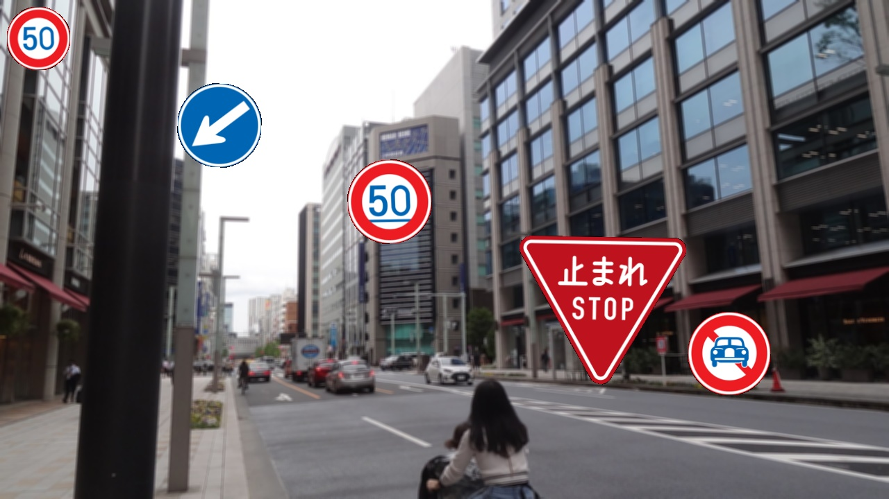
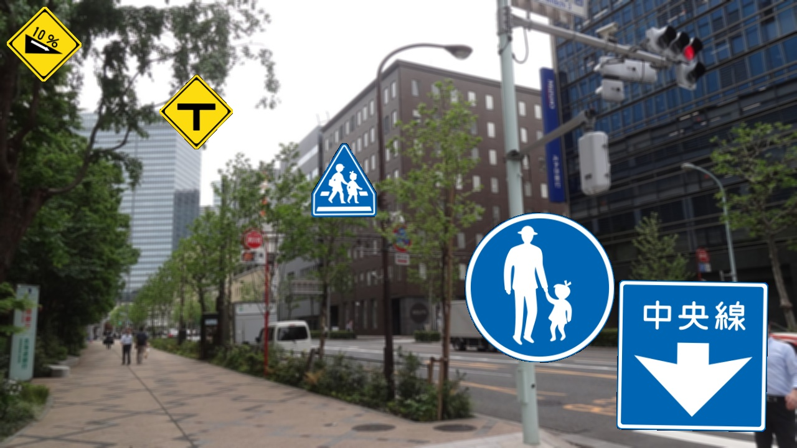
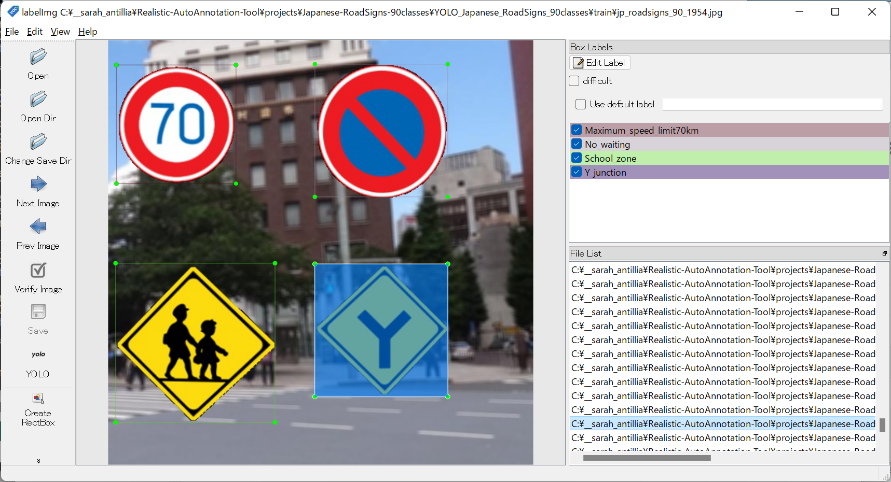

<h1>Antillia Realistic AutoAnnotation Tool (Updated: 2022/07/07)</h1>
This is an experimental project to implement <b>Antillia Realistic AutoAnnotation Tool(ARAAT)</b> for Object Detection. 

It generates a realistic image dataset for training and validation, which is artificially made from a small 
real or realistic images, and annotate those images automatically for object detection. 
For example, imagine to take a lot of real roadsigns pictures in US in a real world for 
training of object detection task.
Probably, it is difficult to gather such a pictures, because the classes of roadsigns in US is more than 160.
One of other approaches to alleviate the difficulties is  
to generate a lot of realistic and artificial images from some real or realistic object images including illustration
 by using any image augmentation methods.
In this project, we try to design and implement a Realistic AutoAnnotation Tool, which genenetes a 
realistc images dataset, and annotation files to those images automatically,without any manual mouse operations 
of a GUI-based annotation tool.
  
 
<a href="#1">1 Antillia Realistic AutoAnnotation Tool</a> 
<a href="#2">2 Generate Resized images</a> 
<a href="#3">3 Generate Enhanced images</a> 
<a href="#4">4 Create YOLO dataset</a> 
<a href="#5">5 Create TFRecord dataset </a> 
<a href="#6">6 Create COCO dataset</a> 
<a href="#7">7 Run create command</a> 
<a href="#8">8 US_RoadSigns_160classes</a> 
<a href="#9">9 US_RoadSigns_86classes</a> 
<a href="#10">10 UK_RoadSigns_94classess</a> 
<a href="#11">11 FR_RoadSigns_152classess</a> 

 
<li>
 Added a sample project <b>UK_RoadSigns_94classess</b> (2022/07/07).
</li>
<li>
 Added a sample project <b>FR_RoadSigns_152classess</b> (2022/07/07).
</li>

 
<h2><a name="1">1 Antillia Realistic AutoAnnotation Tool</a> </h2>
We have been using tensorflow 2.4.0 and Python 3.8 environment on Windows11. 
Please clone this repository to your local machine. 
git clone https://github.com/sarah-antillia/Realistic-AutoAnnotation-Tool.git 
You can see the following tree structure by tree command, and the projects folder contains two sample project 
<b>Japanese-RoadSigns-90classes</b> and <b>USA_RoadSigns_160classes</b>.  
<h3>1.1 Folder tree structure</h3>
<pre>
├─background
│  └─roadsigns
│      ├─test
│      ├─train
│      └─valid
├─batch_templates
├─config_templates
└─projects
    ├─FR_RoadSigns_152classes
    │  ├─configs
    │  └─PNG_FR_RoadSigns_152classes_Master
    ├─JP_RoadSigns_90classes
    │  ├─configs
    │  └─PNG_JP_RoadSigns_90classes_Master
    ├─UK_RoadSigns_94classes
    │  ├─configs
    │  └─PNG_UK_RoadSigns_94classes_Master
    ├─US_RoadSigns_160classes
    │  ├─configs
    │  └─PNG_US_Roadsigns_160classes_Master
    └─US_RoadSigns_86classes
        ├─configs
        └─PNG_US_RoadSigns_86classes_Master
</pre>
 
<h3>1.2 Prepare a set of object and background images  </h3>
If you would like to get started your own project, you have to do: 
1. Create your own project under the <b>projects</b> folder. 
2. Prepare a minimum set of object images of some classes. 
  Those images must be PNG format, and image size less than 240x240.   
3. Prepare a set of background images to create train and valid image dataset. 
  Those backgrounds must have same image size 512x512.  
4. Prepare a set of background images to create test image dataset. 
  Those backgrounds must have same image size 1280x720.  
   
The minimum image set will be augmented by our augmentation tool(python scripts), and the augmented images 
will be pasted on train, valid, test bacground images to generate realistic dataset for object detection. 
 

<h3>1.3 Create a project</h3>
Please use ProjectCreator.py to create your own project. 
<pre>
python ProjectCreator.py category dataset_name project_name
</pre>
Please run the following command to create <b>JP_RoadSigns_90classes</b> project: 
<pre>
python ProjectCreator.py roadsigns jp_roadsigns Japanese_RoadSigns_90classes
</pre>
<b>Sample images of PNG_JP_RoadSigns_Master</b> 
 

 Those PNG files have been take from the following websites: 
<a href="https://en.wikipedia.org/wiki/Road_signs_in_Japan">en.wikipedia.org:Road signs in Japan</a>
 
<a href="https://commons.wikimedia.org/wiki/Road_signs_in_Japan">commons.wikimedia.org: Road signs in Japan</a>
 
The following backgroud foloders contain background jpg images files, which will be used as the background images to generate
test, train and valid dataset.  

<pre>
└─background
    └─roadsigns
        ├─test
        ├─train
        └─valid
</pre>
The ProjectCretator.py generates <b>configs</b> folder, which contain the following configuration files. 

<pre>
0_image_resizer.conf
1_image_enhancer.conf
2_yolo_train_dataset_creator.conf
3_yolo_test_dataset_creator.conf
4_yolo2tfrecord_converter.conf
5_yolo2coco_converter.conf
6_yolo2pascalvoc_converter.conf
color_enhancer.conf
warp_parallelogramer_medium.conf
warp_parallelogramer_small.conf
warp_rotator_medium.conf
warp_rotator_small.conf
warp_trapezoider_medium.conf
warp_trapezoider_small.conf
</pre>
, and the following bat files under your project folder. 
<pre>
0_image_resizer.bat
1_image_enhancer.bat
2_yolo_train_dataset_creator.bat
3_yolo_test_dataset_creator.bat
4_yolo2tfrecord_converter.bat
5_yolo2coco_converter.bat
6_yolo2pascalvoc_converter.bat
create.bat
tfrecord_inspector.bat
</pre>

 

<h2><a name="2">2 Generate Resized images</a> </h2>

Please move to your project directory, and run the following <b>0_image_enhancer.bat</b> to resize original PNG roadsigns images: 
<pre>
./0_image_resizer.bat
</pre>
, which is the followng: 
<pre>
rem 0_image_resizer.bat
python ../../PNGImageResizer.py ./configs/0_image_resizer.conf
</pre>
, and the 0_image_enhancer.conf in configs folder. 
<pre>
;0_image_resizer.conf
[configs]
version     = "2.2"
master_dir  = "./PNG_JP_RoadSigns_90classes_Master"
medium_dir  = "./PNG_JP_RoadSigns_90classes_Medium_Mixed"
small_dir   = "./PNG_JP_RoadSigns_90classes_Small_Mixed"
ratios      = [0.5, 1.0, 1.5, 2.0, ]
</pre>

This will generate the following resized image folders: 
<pre>
├─PNG_JP_RoadSigns_90classes_Medium_Mixed
└─PNG_JP_RoadSigns_90classes_Small_Mixed
</pre>

 

<h2><a name="3">3 Generate Enhanced images</a> </h2>

Please move to your project directory, and run the following <b>1_image_enhancer.bat</b> to augment PNG roadsings images generated by <b>0_image_resizer.bat</b> 
<pre>
./1_image_enhancer.bat
</pre>
, which is the followng: 
<pre>
python ../../ImageEnhancer.py ./configs/1_image_enhancer.conf train
python ../../ImageEnhancer.py ./configs/1_image_enhancer.conf test
</pre>
, and the image_enhancer.conf in configs folder. 
<pre>
;1_image_enhander.conf
;2022/06/23/ Added medium and small sections.
[configs]
version                 = "2.2"

[medium]
warp_rotator_config     = "./configs/warp_rotator_medium.conf"
warp_trapezoider_config = "./configs/warp_trapezoider_medium.conf"
warp_parallelogramer    = "./configs/warp_parallelogramer_medium.conf"
enhanced_images_dir     = "./Enhanced_images_medium"

[small]
warp_rotator_config     = "./configs/warp_rotator_small.conf"
warp_trapezoider_config = "./configs/warp_trapezoider_small.conf"
warp_parallelogramer    = "./configs/warp_parallelogramer_small.conf"
enhanced_images_dir     = "./Enhanced_images_small"
</pre>

This will generate the following enhanced image folders: 
<pre>
├─Enhanced_images_medium_test
├─Enhanced_images_medium_train
├─Enhanced_images_small_test
└─Enhanced_images_small_train
</pre>

<h2><a name="4">4 Create YOLO dataset</a></h2>

<h3>4.1 Create train and valid dataset</h3>
In your projecr folder, please run the following <b>2_yolo_train_dataset_creator.bat</b>. 
<pre>
./2_yolo_train_dataset_creator.bat
</pre>
, which is the following: 
<pre>
python ../../YOLOTrainDatasetCreator.py ./configs/2_yolo_train_dataset_creator.conf master
</pre>
, and yolo_train_dataset_creator.conf 
<pre>
; 2_yolo_train_dataset_creator.conf

[configs]
version         = "2.1"

[dataset]
name            = "jp_roadsigns"
copyright       = "antillia.com"
version         = "1.1"
background_size = [512,512]
max_image_size  = [250,250]
classes         = "./classes.txt"

auto_splitter   = True

[master]
backgrounds_dir   = "../../background/roadsigns/train"
medium_images_dir = "./Enhanced_images_medium_train"
small_images_dir  =  "./Enhanced_images_small_train"
output_dir        = "./YOLO_JP_RoadSigns_90classes/master"
  
[train]
backgrounds_dir   = "../../background/roadsigns/train"
images_dir        = "./Enhanced_images_train"
output_dir        = "./YOLO_JP_RoadSigns_90classes/train"

[valid]
backgrounds_dir   = "../../background/roadsigns/valid"
images_dir        = "./Enhanced_images_valid"
output_dir        = "./YOLO_JP_RoadSigns_90classes/valid"
</pre>

This bat file wll generate <b>YOLO_JP_RoadSigns_90classes</b> folder, which contain train and valid dataset(images and annotation files).
<pre>
└─YOLO_JP_RoadSigns_90classes
    ├─master
    ├─train
    └─valid
</pre>
The train and valid dataset will be generated automatically from the master by a splitting tool. 
<!--
You can download YOLO Dataset from <a href="https://drive.google.com/drive/folders/1jLK8xfoYydK47q8nomsqCjzDhyg2Npvd?usp=sharing">Japanese-RoadSigns-90classes-V5</a>. 
 
-->
 
Sample images of YOLO master dataset 
<table>
<tr><td>

</td></tr>
<tr><td>

</td></tr>
<tr><td>

</td></tr>
<tr><td>

</td></tr>
<tr><td>

</td></tr>
<tr><td>

</td></tr>
<tr><td>

</td></tr>
</table>

<h3>4.2 Create realistic test dataset</h3>
In your projecr folder, please run the following <b>3_yolo_test_dataset_creator.bat</b> to create realistic test dataset. 
<pre>
./3_yolo_test_dataset_creator.bat
</pre>
, which is the following: 
<pre>
python ../../YOLOTestDatasetCreator.py ./configs/3_yolo_test_dataset_creator.conf
</pre>
, and 3_yolo_test_dataset_creator.conf. 
<pre>
; 3_yolo_test_dataset_creator.conf
[configs]
version         = "2.0"

[dataset]
name            = "jp_roadsigns"
copyright       = "antillia.com"
version         = "1.0"
background_size = [1280,720]
max_image_size  = [240, 240]
classes         = "./classes.txt"

[test]
backgrounds_dir   = "../../background/roadsigns/test"
images_dir      = "./Enhanced_images_small_test"
output_dir      = "./realistic_test_dataset"
num_test_dataset= 100
</pre>

This wll generate realistc_test_dataset folder, which contain test dataset(images and annotation files).
<pre>
└─realistic_test_dataset
</pre>
You can download realistic_test_dataset from <a href="https://drive.google.com/drive/folders/1jLK8xfoYydK47q8nomsqCjzDhyg2Npvd?usp=sharing">Japanese-RoadSigns-90classes-V5</a>. 
 
<table>
Sample images of <b>realistic_test_dataset</b> 
<table>
<tr><td>

</td></tr>
<tr><td>

</td></tr>
<tr><td>

</td></tr>
<tr><td>

</td></tr>
<tr><td>

</td></tr>
<tr><td>

</td></tr>
<tr><td>

</td></tr>
</table>
 

<h2><a name="5">5 Create TFRecord dataset</a> </h2>
In your projecr folder, please run the following <b>4_yolo2tfrecord_converter.bat</b> 
to convert YOLO annotation dataset to TFRecord: 

<pre>
./4_yolo2tfrecord_converter.bat  
</pre>
, which is the following. 
<pre>
python ../../YOLO2TFRecordConverter.py ./configs/4_yolo2tfrecord_converter.conf 
</pre>
, and 4_yolo2tfrecord_converter.conf. 
<pre>
; 4_yolo2tfrecord_converter.conf
[configs]
version      = "2.0"

[dataset]
name         = "jp_roadsigns"
copyright    = "antillia.com"
version      = "2.0"
classes      = "./classes.txt"

tfrecord_dir = "./TFRecord_JP_RoadSigns_90classes"

label_map_pbtxt = "./TFRecord_JP_RoadSigns_90classes/label_map.pbtxt"
label_map_yaml  = "./TFRecord_JP_RoadSigns_90classes/label_map.yaml"

[train]
images_dir   = "./YOLO_JP_RoadSigns_90classes/train"
anno_dir     = "./YOLO_JP_RoadSigns_90classes/train"

[valid]
images_dir   = "./YOLO_JP_RoadSigns_90classes/valid"
anno_dir     = "./YOLO_JP_RoadSigns_90classes/valid"
</pre>

This wll generate <b>TFRecord_JP_RoadSigns_90classes</b> folder, which contain train and valid tfrecords.
<pre>
└─TFRecord_JP_RoadSigns_90classes
    ├─train
    └─valid
</pre>
<!--
You can download TFRecord Dataset from <a href="https://drive.google.com/drive/folders/1jLK8xfoYydK47q8nomsqCjzDhyg2Npvd?usp=sharing">Japanese-RoadSigns-90classes-V5</a>. 
 
YOLO annotation inspection(LabelImg) 
 
-->
Please run the following bat file to inspect the generated tfrecord. 
tfrecord_inspect.bat 
<pre>
python ../../TFRecordInspector.py ^
  ./TFRecord_JP_RoadSigns_90classes/train/train.tfrecord ^
  ./TFRecord_JP_RoadSigns_90classes/label_map.pbtxt ^
  ./Inspector/train
</pre>

Objects count in train.tfrecord: 
 
 
Sample images in train.tfrecord: 
 

Label map
<a href="./projects/JP_RoadSigns_90classes/label_map.pbtxt">label_map.pbtxt</a>
 
 
<h2><a name="6">6 Create COCO dataset</a> </h2>
In your project directory, please run the following <b>5_yolo2coco_converter.bat</b> to convert YOLO annotation dataset to COCO annotation dataset: 
<pre>
,/5_yolo2coco_converter.bat
</pre>
, which is the following: 
<pre>
python ../../YOLO2COCOConverter.py ./configs/5_yolo2coco_converter.conf 
</pre>
,and 5_yolo2coco_converter.conf.  
<pre>
; 5_yolo2coco_converter.conf
[configs]
version      = "2.0"

[dataset]
name         = "jp_roadsigns"
copyright    = "antillia.com"
version      = "2.0"
classes      = "./classes.txt"

[train]
images_dir  = "./YOLO_JP_RoadSigns_90classes/train"
output_dir  = "./COCO_JP_RoadSigns_90classes/train"

[valid]
images_dir  = "./YOLO_JP_RoadSigns_90classes/valid"
output_dir  = "./COCO_JP_RoadSigns_90classes/valid"
</pre>

You can download COCO Dataset from <a href="https://drive.google.com/drive/folders/1jLK8xfoYydK47q8nomsqCjzDhyg2Npvd?usp=sharing">Japanese-RoadSigns-90classes-V5</a>. 
 
<h2><a name="7">7 Run create command</a> </h2>
If you would like to create YOLO, TFRecord and COCO dataset from your master image dataset at once, 
please run the following batch processing command: 
<pre>
create.bat
</pre>
, which is the following.
<pre>
call 0_image_resizer.bat
call 1_image_enhancer.bat
call 2_yolo_train_dataset_creator.bat
call 3_yolo_test_dataset_creator.bat
call 4_yolo2tfrecord_converter.bat
call 5_yolo2coco_converter.bat
</pre>
You can download the following dataset created by the command above:
<pre>
COCO_JP_RoadSigns_90classes.zip
TFRecord_JP_RoadSigns_90classes.zip
realistic_test_dataset.zip
YOLO_JP_RoadSigns_90classes.zip
</pre>
from here
 <a href="https://drive.google.com/drive/folders/18wA1pOWdgu6k2SuC2uL7cDQpcfMy24K0?usp=sharing">JP_RoadSigns_90classes_V7</a>. 
 

<h2><a name="8">8 US_RoadSigns_160classes</a></h2>
<h3><a name="8.1">8.1. Create US_RoadSigns_160classes project</a></h3>
You can create <b>US_RoadSigns_160classes</b> project by running the following command.
<pre>
python ProjectCreator.py roadsigns us_roadsigns US_RoadSigns_160classes
</pre>
<b>Sample images of PNG_US_RoadSigns_160classes_Master</b> 
 

The PNG files in US_RoadSigns_160classes_Master have been take from the following websites: 
<a href="https://en.wikipedia.org/wiki/Road_signs_in_the_United_States">Road signs in the United States</a>
 
<h3><a name="8.2">8.2. Run create command</a> </h3>
Please run the following batch processing command to create YOLO, TFRecord and COCO dataset from your base image dataset at once, 
<pre>
create.bat
</pre>
<!--
Please run the following bat file to inspect the generated train.tfrecord. 
<pre>
tfrecord_inspect.bat 
</pre>

Objects count in train.tfrecord: 
 

Sample Images in train.tfrecord: 
 
 
-->
 
<h2><a name="9">9 US_RoadSigns_86classes</a></h2>
<h3><a name="9.1">9.1. Create US_RoadSigns_86classes project</a></h3>
You can create <b>US_RoadSigns_86classes</b> project by running the following command.
<pre>
python ProjectCreator.py roadsigns us_roadsigns US_RoadSigns_86classes
</pre>
<b>Sample images of PNG_US_RoadSigns_86classes_Master</b> 
 

The PNG files in US_RoadSigns_86classes_Master have been take from the following websites: 
<a href="https://en.wikipedia.org/wiki/Road_signs_in_the_United_States">Road signs in the United States</a>
 

 
<h3><a name="9.2">9.2. Run create command</a> </h3>
Please run the following batch processing command to create YOLO, TFRecord and COCO dataset from your base image dataset at once, 
<pre>
create.bat
</pre>
<!--
Please run the following bat file to inspect the generated train.tfrecord. 
<pre>
tfrecord_inspect.bat 
</pre>
Objects count in train.tfrecord: 
 
Sample Images in train.tfrecord: 
 
 
 
-->
<!--
You can download the following dataset created by the command above:
<pre>
COCO_USA_RoadSigns_86classes.zip
TFRecord_USA_RoadSigns_86classes.zip
realistic_test_dataset.zip
YOLO_USA_RoadSigns_86classes.zip
</pre>
from here
 <a href="https://drive.google.com/drive/folders/19JCN8gfT8RJH9wJStby-Sa9bfG0pel2L?usp=sharing">USA_RoadSigns_86classes</a>. 
 

See also: <a href="https://github.com/atlan-antillia/EfficientDet-Slightly-Realistic-USA-RoadSigns-86classes">EfficientDet-Slightly-Realistic-USA-RoadSigns-86classes</a>
-->

 
<h2><a name="10">10 UK_RoadSigns_94classes</a></h2>
<h3><a name="10.1">10.1. Create UK_RoadSigns_94classes project</a></h3>
You can create <b>UK_RoadSigns_94classes</b> project by running the following command.
<pre>
python ProjectCreator.py roadsigns uk_roadsigns UK_RoadSigns_94classes
</pre>
<b>Sample images of PNG_UK_RoadSigns_94classes_Master</b> 
 

The PNG files in UK_RoadSigns_94classes_Master have been take from the following websites: 
<a href="https://en.wikipedia.org/wiki/Road_signs_in_the_United_Kingdom">Road signs in the United Kingdom</a>
 

 
<h3><a name="9.2">9.2. Run create command</a> </h3>
Please run the following batch processing command to create YOLO, TFRecord and COCO dataset from your base image dataset at once, 
<pre>
create.bat
</pre>

 
<h2><a name="11">11 FR_RoadSigns_152classes</a></h2>
<h3><a name="11.1">11.1. Create FR_RoadSigns_152classes project</a></h3>
You can create <b>FR_RoadSigns_152classes</b> project by running the following command.
<pre>
python ProjectCreator.py roadsigns fr_roadsigns FR_RoadSigns_152classes
</pre>
<b>Sample images of PNG_FR_RoadSigns_152classes_Master</b> 
 

The PNG files in FR_RoadSigns_152classes_Master have been take from the following websites: 
<a href="https://en.wikipedia.org/wiki/Road_signs_in_France">Road signs in France</a>
 

 
<h3><a name="9.2">9.2. Run create command</a> </h3>
Please run the following batch processing command to create YOLO, TFRecord and COCO dataset from your base image dataset at once, 
<pre>
create.bat
</pre>
