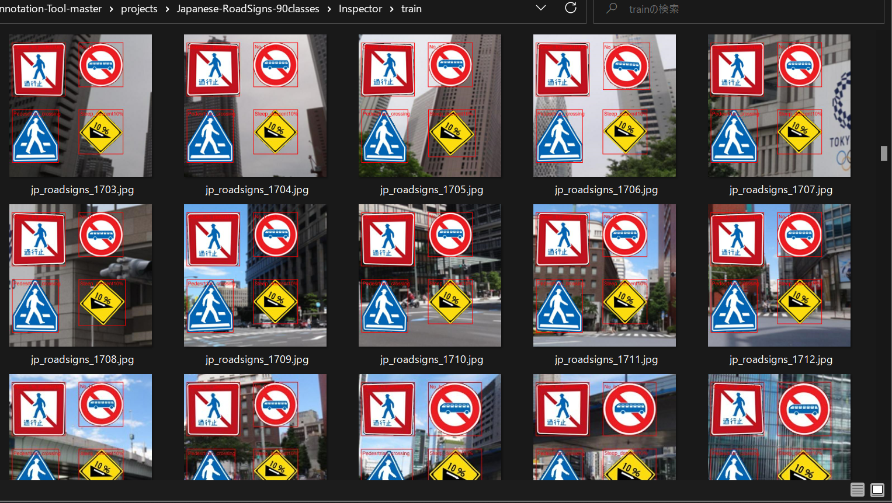

<h1>Realistic AutoAnnotation Tool (Updated: 2022/05/04)</h1>
This is an experimental project to implement <b>A Realistic AutoAnnotation Tool(ARAAT)</b> for Object Detection. 

It generates a realistic dataset for training and validation, which is an artificially made from a lot of 
base images, and annotate those images automatically for object detection.

<h2>1 Realistic AutoAnnotation Tool </h2>
Please clone this repository to your local machine. 
git clone https://github.com/sarah-antillia/Realistic-AutoAnnotation-Tool.git 
You can see the following tree structure by tree command, and the projects folder contains a sample project 
<b>Japanese-RoadSigns-90classes</b>.  
<h3>1.1 Folder tree structure</h3>
<pre>
└─projects
    └─Japanese-RoadSigns-90classes
        ├─background_test
        ├─background_train
        ├─background_valid
        ├─COCO_Japanese_RoadSigns_90classes
        │  ├─train
        │  └─valid
        ├─Enhanced_images_test
        ├─Enhanced_images_train
        ├─Enhanced_images_valid
        ├─PNG_RoadSigns_Japan_90classes_small
        ├─PNG_RoadSigns_Japan_90classes_tiny
        ├─realistic_test_dataset
        ├─TFRecord_Japanese_RoadSigns_90classes
        │  ├─train
        │  └─valid
        └─YOLO_Japanese_RoadSigns_90classes
            ├─train
            └─valid

</pre>
 
<b>PNG_RoadSigns_Japan_90classes_small</b> and <b>PNG_RoadSigns_Japan_90classes_tiny</b> folders contain a set of 
90 classes Japanese RoadSigns PNG files. Those PNG files have been take from the following websites: 
<a href="https://en.wikipedia.org/wiki/Road_signs_in_Japan">en.wikipedia.org:Road signs in Japan</a>
 
<a href="https://commons.wikimedia.org/wiki/Road_signs_in_Japan">commons.wikimedia.org: Road signs in Japan</a>
 
 
The following folders contain annotated train and valid dataset which have been generated byt this tool.  
<b><a href="./projects/Japanese_RoadSigns_90classes/COCO_Japanese_RoadSigns_90classes">COCO_Japanese_RoadSigns_90classes</a></b> 
<b><a href="./projects/Japanese_RoadSigns_90classes/TFRecord_Japanese_RoadSigns_90classes">TFRecord_Japanese_RoadSigns_90classes</a></b> 
<b><a href="./projects/Japanese_RoadSigns_90classes/YOLO_Japanese_RoadSigns_90classes ">YOLO_Japanese_RoadSigns_90classes</a></b> 
 
The following folder contains test dataset which has been generate by this tool. 
<b><a href="./projects/Japanese-RoadSigns-90classes/realistic_test_dataset">realistic_test_dataset</a></b> 
 
<h3>1.2 Create your own project </h3>
If you would like to get started your own project, you have to do: 
1. Create your own project under the <b>projects</b> folder. 
2. Prepare a minimum set of object images of some classes. 
  Those images must be PNG format, and image size less than 240x240.   
3. Prepare a set of background images to create train and valid image dataset. 
  Those backgrounds must have same image size 512x512.  
4. Prepare a set of background images to create test image dataset. 
  Those backgrounds must have same image size 1280x720.  
The minimum image set will be augumented by our augumentation tool(python scripts), and the augumented images 
will be pasted on train, valid, test bacground images to generate realistic dataset for object detection. 
 
 
<h2>2 Generate enhanced images </h2>
For our sample project <b>Japanese-RoadSigns-90classes</b>, we have created the following bat(sh) file 
<b>jp_roadsigns_image_enhancer.bat</b>, which will create enhanced images from base object images. 
<pre>
python ImageEnhancer.py ./projects/Japanese-RoadSigns-90classes/image_enhancer.conf train
python ImageEnhancer.py ./projects/Japanese-RoadSigns-90classes/image_enhancer.conf valid
python ImageEnhancer.py ./projects/Japanese-RoadSigns-90classes/image_enhancer.conf test
</pre>

For example, the first line of this bat file will generate Enhancesd_train images dataset
from base images dataset, based on <b>image_enhancer.conf</b>.
<pre>
;image_enhander.conf
[configs]
warp_rotator_config_small     = "./projects/Japanese-RoadSigns-90classes/warp_rotator_small.conf"
warp_rotator_config_tiny      = "./projects/Japanese-RoadSigns-90classes/warp_rotator_tiny.conf"
warp_trapezoider_config_small = "./projects/Japanese-RoadSigns-90classes/warp_trapezoider_small.conf"
warp_trapezoider_config_tiny  = "./projects/Japanese-RoadSigns-90classes/warp_trapezoider_tiny.conf"
enhanced_images_dir           = "./projects/Japanese-RoadSigns-90classes/Enhanced_images"
</pre>

For example, warp_rotator_small.conf is the following, which can be used in ImageWarpRotator.py 
<pre>
; warp_rotator_small.conf
[train]
input_dir   = "./projects/Japanese-RoadSigns-90classes/PNG_RoadSigns_Japan_90classes_small"
;output_dir = "./projects/Japanese-RoadSigns-90classes/train_rotated"
angles      = [ -4, -2, 3, 4,] 

[valid]
input_dir   = "./projects/Japanese-RoadSigns-90classes/PNG_RoadSigns_Japan_90classes_small"
;output_dir = "./projects/Japanese-RoadSigns-90classes/train_valid"
angles      = [-3, 1, 2,] 

[test]
input_dir   = "./projects/Japanese-RoadSigns-90classes/PNG_RoadSigns_Japan_90classes_small"
;output_dir = "./projects/Japanese-RoadSigns-90classes/test_valid"
angles      = [ -1, 1,] 
</pre>

Similarly, warp_trapezoider_small.conf is the following, which can be used in ImageWarpTrapezoider.py 
<pre>

[train]
input_dir   = "./projects/Japanese-RoadSigns-90classes/PNG_RoadSigns_Japan_90classes_small"
;output_dir = "./projects/Japanese-RoadSigns-90classes/train_trapezoided"
policy      = 2
ws_list     = [0.01, 0.02, 0.04]
hs_list     = [0.01, 0.02, 0.04]

[valid]
input_dir   = "./projects/Japanese-RoadSigns-90classes/PNG_RoadSigns_Japan_90classes_small"
;output_dir = "./projects/Japanese-RoadSigns-90classes/valid_trapezoided"
policy      = 2
ws_list     = [0.02, 0.03]
hs_list     = [0.02, 0.03]

[test]
input_dir   = "./projects/Japanese-RoadSigns-90classes/PNG_RoadSigns_Japan_90classes_small"
;output_dir = "./projects/Japanese-RoadSigns-90classes/test_trapezoided"
policy      = 2
ws_list     = [0.01]
hs_list     = [0.02]
</pre>

<h2>3 Create YOLO dataset</h2>
For our sample project <b>Japanese-RoadSigns-90classes</b>, we have created the following bat(sh) file. 
jp_roadsigns_yolo_train_dataset_creator.bat , which will create train and valid dataset with YOLO annotation format.
<pre>
python YOLOTrainDatasetCreator.py ./projects/Japanese-RoadSigns-90classes/train_dataset_creator.conf train
python YOLOTrainDatasetCreator.py ./projects/Japanese-RoadSigns-90classes/train_dataset_creator.conf valid
</pre>
train_dataset_creator.conf 
<pre>
; train_dataset_creator.conf
[dataset]
name            = "jp_roadsigns_90"
copyright       = "antillia.com"
version         = "1.0"
background_size = [512,512]
max_image_size  = [240,240]
classes         = "./projects/Japanese-RoadSigns-90classes/classes.txt"

[train]
backgrounds_dir = "./projects/Japanese-RoadSigns-90classes/background_train"
images_dir      = "./projects/Japanese-RoadSigns-90classes/Enhanced_images_train"
output_dir      = "./projects/Japanese-RoadSigns-90classes/YOLO_Japanese_RoadSigns_90classes/train"

[valid]
backgrounds_dir = "./projects/Japanese-RoadSigns-90classes/background_valid"
images_dir      = "./projects/Japanese-RoadSigns-90classes/Enhanced_images_valid"
output_dir      = "./projects/Japanese-RoadSigns-90classes/YOLO_Japanese_RoadSigns_90classes/valid"
</pre>

Sample images of train dataset 
<table>
<tr><td>

</td></tr>
<tr><td>

</td></tr>
<tr><td>

</td></tr>
<tr><td>

</td></tr>
<tr><td>

</td></tr>
<tr><td>

</td></tr>
<tr><td>

</td></tr>

</table>
 
YOLO annotation inspection(Labelme) 
 

 
<h2>4 Create TFRecord dataset </h2>
For our sample project <b>Japanese-RoadSigns-90classes</b>, we have created the following bat(sh) file <b>
jp_roadsigns_tfrecord_creator.bat</b>, which will create train and valid TFRecord from YOLO annotated dataset.
<pre>
python YOLO2TFRecordCreator.py ./projects/Japanese-RoadSigns-90classes/yolo2tfrecord_creator.conf
</pre>

yolo2tfrecord_creator.conf 
<pre>
; yolo2tfrecord_creator.conf

[dataset]
name         = "jp_roadsigns"
copyright    = "antillia.com"
version      = "1.0"
classes      = "./projects/Japanese-RoadSigns-90classes/classes.txt"
tfrecord_dir = "./projects/Japanese-RoadSigns-90classes/TFRecord_Japanese_RoadSigns_90classes"
label_map_pbtxt  = "./projects/Japanese-RoadSigns-90classes/TFRecord_Japanese_RoadSigns_90classes/label_map.pbtxt"
label_map_yaml   = "./projects/Japanese-RoadSigns-90classes/TFRecord_Japanese_RoadSigns_90classes/label_map.yaml"

[train]
images_dir  = "./projects/Japanese-RoadSigns-90classes/YOLO_Japanese_RoadSigns_90classes/train"
anno_dir    = "./projects/Japanese-RoadSigns-90classes/YOLO_Japanese_RoadSigns_90classes/train"

[valid]
images_dir  = "./projects/Japanese-RoadSigns-90classes/YOLO_Japanese_RoadSigns_90classes/valid"
anno_dir    = "./projects/Japanese-RoadSigns-90classes/YOLO_Japanese_RoadSigns_90classes/valid"

</pre>

 
Please run the following bat file to inspect the generated tfrecord. 
tfrecord_inspect.bat 
<pre>
python TFRecordInspector.py  ^
  ./projects/Japanese-RoadSigns-90classes/TFRecord_Japanese_RoadSigns_90classes/train/train.tfrecord ^
  ./projects/Japanese-RoadSigns-90classes/TFRecord_Japanese_RoadSigns_90classes/label_map.pbtxt ^
  ./Inspector/train
</pre>
 
Objects count in tfrecord: 
 
 
Sample images in tfrecord: 
 

 
<h2>5 Create COCO dataset </h2>
For our sample project <b>Japanese-RoadSigns-90classes</b>, we have created the following bat(sh) file <b>
jp_roadsigns_coco_creator.bat</b>, which will create train and valid coco annotation json files 
from YOLO annotated dataset.
<pre>
python YOLO2TFCOCOCreator.py ./projects/Japanese-RoadSigns-90classes/yolo2coco_creator.conf
</pre>

yolo2coco_creator.conf 

<pre>
 yolo2coco_creator.conf

[dataset]
name         = "jp_roadsigns_90"
copyright    = "antillia.com"
version      = "1.0"
classes      = "./projects/Japanese-RoadSigns-90classes/classes.txt"

[train]
images_dir  = "./projects/Japanese-RoadSigns-90classes/YOLO_Japanese_RoadSigns_90classes/train"
output_dir  = "./projects/Japanese-RoadSigns-90classes/COCO_Japanese_RoadSigns_90classes/train"

[valid]
images_dir  = "./projects/Japanese-RoadSigns-90classes/YOLO_Japanese_RoadSigns_90classes/valid"
output_dir  = "./projects/Japanese-RoadSigns-90classes/COCO_Japanese_RoadSigns_90classes/valid"

</pre>

<h2>6 Create realistic test dataset </h2>
For our sample project <b>Japanese-RoadSigns-90classes</b>, we have created the following bat(sh) file
<b>jp_roadsigns_yolo_test_dataset_creator.bat</b>, which will create realistic test dataset with YOLO annotation.
<pre>
python YOLOTestDatasetCreator.py ./projects/Japanese-RoadSigns-90classes/test_dataset_creator.conf
</pre>

<pre>
; test_dataset_creator.conf
[dataset]
name            = "jp_test_roadsigns_90"
copyright       = "antillia.com"
version         = "1.0"
background_size = [1280,720]
max_image_size  = [240, 240]
classes         = "./projects/Japanese-RoadSigns-90classes/classes.txt"

[test]
backgrounds_dir = "./projects/Japanese-RoadSigns-90classes/background_test/"
images_dir      = "./projects/Japanese-RoadSigns-90classes/Enhanced_images_test"
output_dir      = "./projects/Japanese-RoadSigns-90classes/realistic_test_dataset"
num_test_dataset= 100

</pre>

Sample images of realist_test_dataset 
<table>
<tr><td>

</td></tr>
<tr><td>

</td></tr>
<tr><td>

</td></tr>
<tr><td>

</td></tr>
<tr><td>

</td></tr>
<tr><td>

</td></tr>
<tr><td>

</td></tr>

</table>

